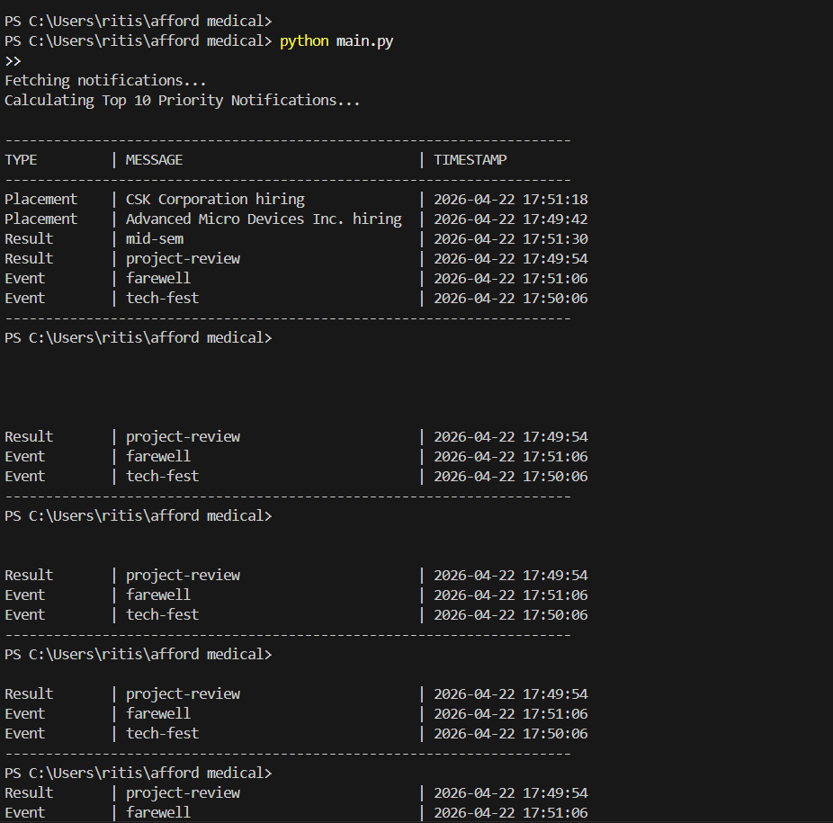
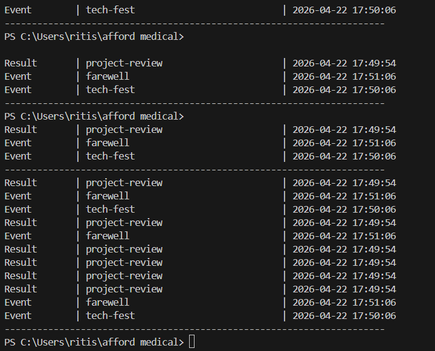

# Stage 1

## Approach: Maintaining the Top 'n' Priority Notifications Efficiently

To efficiently manage and display the top `n` (e.g., 10, 15, 20) most important unread notifications from a continuously growing stream, we use a **Min-Heap (Priority Queue)** data structure.

### Priority Criteria
The priority of a notification is evaluated using two factors:
1. **Weight (Type):** `Placement` > `Result` > `Event`. We assign numeric weights for easy comparison (e.g., Placement = 3, Result = 2, Event = 1).
2. **Recency (Timestamp):** If two notifications have the same weight, the one with the newer timestamp has higher priority.

### Why a Min-Heap?
Maintaining a fully sorted list of all notifications would take `O(N log N)` time. However, since we only need the top `n` notifications, a Min-Heap of size `n` is much more efficient.

- **Initialization:** We initialize an empty Min-Heap.
- **Insertion Logic:** When a new notification arrives:
  1. If the heap has less than `n` elements, we simply push the new notification into the heap. This takes `O(log n)` time.
  2. If the heap already has `n` elements, we compare the new notification with the **root of the Min-Heap** (which represents the *least* important notification currently in our top `n`).
  3. If the new notification has a **higher priority** than the root, we pop the root and push the new notification. This operation also takes `O(log n)` time.
  4. If the new notification has a lower priority than the root, we discard it.

### Complexity
- **Time Complexity:** For every incoming notification, the operation takes at most `O(log n)` time. Processing `K` new notifications takes `O(K log n)` time, which is highly efficient and scalable for a high volume of notifications.
- **Space Complexity:** The heap only stores exactly `n` elements at any given time, resulting in an `O(n)` space complexity. This guarantees low memory consumption regardless of how many total notifications exist.

This approach guarantees that the priority inbox continuously stays up to date with the absolute most important `n` notifications without performance degradation over time.

